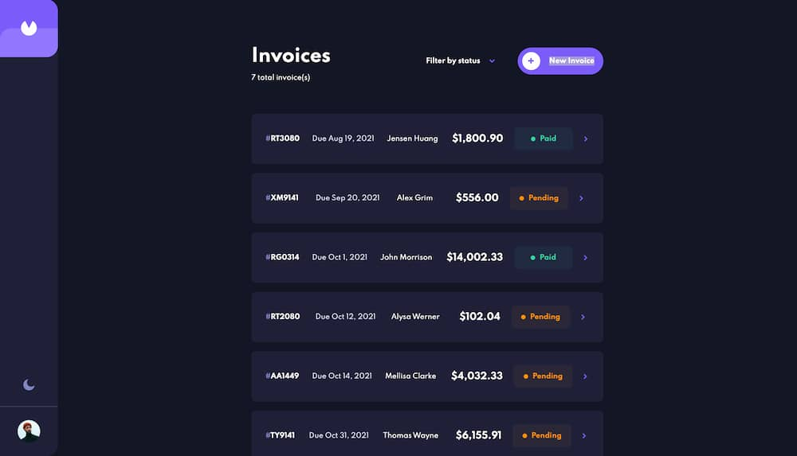

# Frontend Mentor - Invoice app solution

This is a solution to the [Invoice app challenge on Frontend Mentor](https://www.frontendmentor.io/challenges/invoice-app-i7KaLTQjl). Frontend Mentor challenges help you improve your coding skills by building realistic projects.

## Table of contents

- [Overview](#overview)
  - [The challenge](#the-challenge)
  - [Links](#links)
- [Built with](#built-with)
- [Author](#author)

## Overview

### The challenge

Users should be able to:

- View the optimal layout for the app depending on their device's screen size
- See hover states for all interactive elements on the page
- Create, read, update, and delete invoices
- Receive form validations when trying to create/edit an invoice
- Save draft invoices, and mark pending invoices as paid
- Filter invoices by status (draft/pending/paid)
- Toggle light and dark mode
- Keep track of any changes, even after refreshing the browser

### Links

- [Solution URL](https://your-solution-url.com)
- [Live Site URL](https://your-live-site-url.com)

## Built with

- Semantic HTML5 markup
- CSS custom properties
- Flexbox
- CSS Grid
- Mobile-first workflow
- [Sveltekit](https://kit.svelte.dev/) - JS library
- [Superforms](https://superforms.rocks/) - SvelteKit library for server and client validation of forms
- [Melt UI](https://melt-ui.com/) - Headless UI library for Svelte

## Author

- Website - [nazifbara.com](https://www.nazifbara.com)
- Twitter - [@nazifbara](https://www.twitter.com/nazifbara)
- Frontend Mentor - [@nazifbara](https://www.frontendmentor.io/profile/nazifbara)
